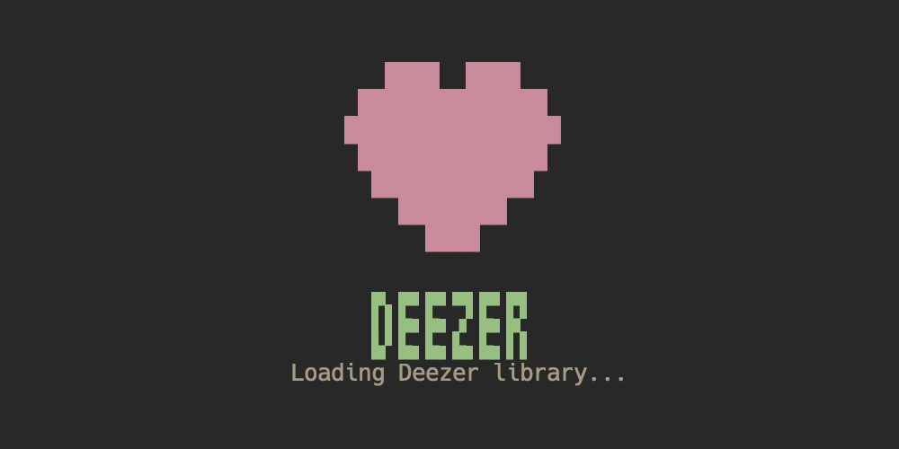

# deezer-tui

TUI client for Deezer, written on Go, based on Bubble Tea.

 

## Features

- Deezer [ARL login](https://www.dumpmedia.com/deezplus/deezer-arl.html#part2) stored per [config](#Configuration)
- Browse Home, Flow, Explore, Favorites, and user playlists
- Search tracks, playlists, and artists
- Queue playback with next/previous controls
- Repeat modes: off, all, one
- Favorites sorting by added date, ascending or descending
- Streaming quality selection: 128 kbps, 320 kbps, and FLAC
- Playback retry on failure with per-song quality fallback
- Seek controls for non-FLAC playback
- Live quality switching while preserving position where possible
- Configurable crossfade and automatic near-end transitions
- Album artwork rendering in supported terminals
- macOS Now Playing / media key integration through the native helper
- macOS native playback helper for pause, resume, volume, and stop
- Linux/other playback through the Go audio backend
- Theme support: Aetheria and Gruvbox

> [!NOTE]
> Discord Rich Presence is intentionally not implemented.

## Controls

```text
Arrow keys / HJKL  Navigate
Tab                Switch focus
Shift+Tab          Switch focus backward
Enter              Select
Space              Play/pause or play selected track
N                  Next track
P                  Previous track
R                  Cycle repeat mode
,                  Seek back 10 seconds
.                  Seek forward 10 seconds
U                  Lower playback quality
I                  Raise playback quality
+ / -              Volume up/down
S                  Toggle Favorites sort direction
/                  Search
Esc                Leave search/settings
Q                  Quit
```

## Build From Source

Requirements:

- Go `1.26.3` or newer
- macOS only: Xcode command line tools for the Swift playback helper

Build the binary from the repository root:

```bash
make build
```

On macOS, `make build` also precompiles the native playback helper into the user cache.

The binary is written to:

```bash
./bin/deezer-tui
```

For a direct development run:

```bash
go run ./cmd/deezer-tui
```

Useful checks:

```bash
make lint
make audit
make test
```

## Configuration

The app reads:

```bash
~/.deezer-tui-config.json
```

At minimum, set a valid Deezer `arl` value:

```json
{
  "arl": "your_deezer_arl"
}
```

The app will fill defaults for missing settings.

## Colors

Currently app has three themes: [Aetheria](https://github.com/JJDizz1L/aetheria), [Gruvbox](https://github.com/morhetz/gruvbox), and Winamp.
Theme can be set in the config file or switched in-app. The default theme is Aetheria:
```json
{
  "theme": "Aetheria"
}
```

## Preview


## TODO

- [] Add login screen to get and save ARL from user input
- [] Add Linux MPRIS/media-key support behind the same media-control abstraction used for macOS
- [] Add lyrics loading and a lyrics view
- [] Improve FLAC seeking, or keep documenting FLAC as restart-only for seek/quality transitions
- [] Add broader manual smoke-test documentation for macOS Control Center/media keys
- [] Improve packaging and release artifacts for macOS and Linux
- [] Harden Deezer payload parsing for API shape changes

## Kudos

Original idea and inspiration was taken from [Minuga-RC/deezer-tui](https://github.com/Minuga-RC/deezer-tui).

## License

MIT. See [LICENSE](LICENSE).
