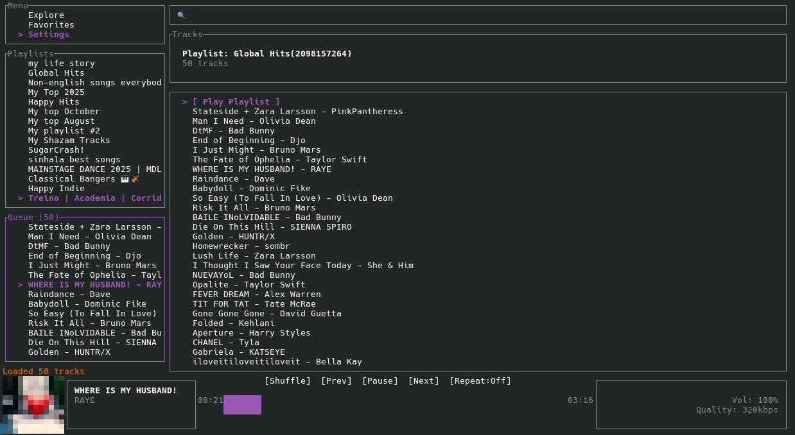

> [!IMPORTANT]  
> This project was heavily "vibecoded" with AI. I put it together quickly because I just wanted a simple deezer TUI for my own personal use.

## Controls

    Arrow Keys - Navigate

    TAB - Switch Focus

    Enter - Select

    P - Play/Pause

    / - Search

    Q - Quit

## Features
- Browse your Playlists, Favorites
- Explore, Home feed
- Search for tracks, albums, artists, and playlists
- Queue
- Album Artwork support (kitty and ueberzugpp has full quality)
- Multiple quality options for streaming (128kbps, 320kbps, and FLAC)
- Discord Rich Presence support
- Cross Fade support (configurable in settings)
- [ARL login](https://www.dumpmedia.com/deezplus/deezer-arl.html#part2)

## Installation

<details>
<summary><b>Arch Based (AUR)</b></summary>
<br>

Available in the AUR as `deezer-tui-bin`. You can install it using your favorite AUR helper like `paru` or `yay`:

```bash
paru -S deezer-tui-bin
```

</details>

<details>
<summary><b>Ubuntu & Debian</b></summary>

    Head over to the (Releases page)[https://github.com/Minuga-RC/deezer-tui/releases] and download the latest .deb file.

    Open your terminal in your downloads folder and run:

Bash

sudo apt install ./deezer-tui_*_amd64.deb

</details>

<details>
<summary><b>Other Linux (Standalone Binary)</b></summary>

If you aren't on Arch or Debian, you can just grab the pre-compiled binary from the Releases page, make it executable, and run it directly!

</details>

## Pick Up This Project

Since I originally made this just to fit my own needs, I don't plan on actively maintaining or expanding it. If you stumble across this and want to pick up the project, clean up the code, or add new features please do!